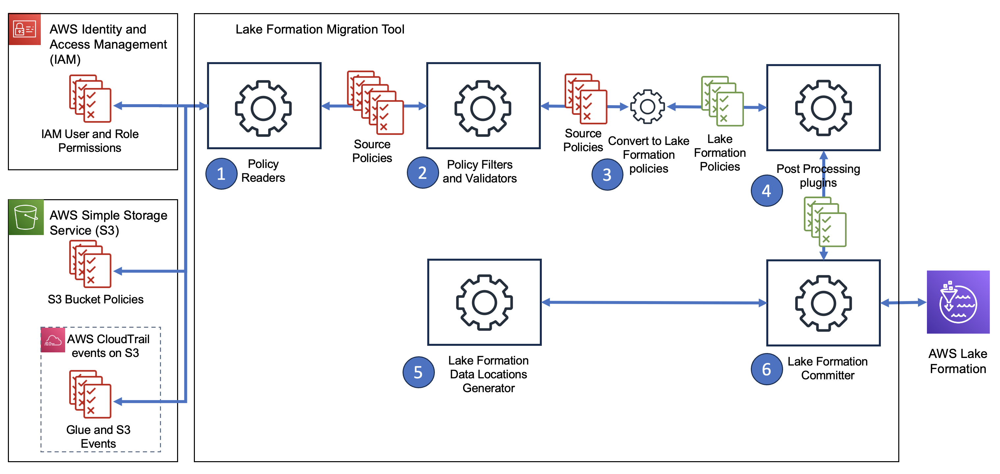

# LF Policy Migration Tool

> **NOTE: This tool is early stages of its development so please be cautious of its use. Please use only dryrun only mode and validate output. **

This tool is to assist customers with adopting Lake Formation from their existing systems. This tool helps with the policy migration part of the adoption of Lake Formation. For a full guide on how to adopt Lake Formation, please see https://aws.github.io/aws-lakeformation-best-practices.

This tool assists with policy migration by looking at a variety of sources, translate to equivalent Lake Formation policies, and if requested, apply those policies. The policies that are generated are named resource policies, and does not yet support the use of LF-Tags. See limitations section for further limitations of this tool.

This tool has a pipeline for policies. The pipeline can be viewed as the following:



1. Policy Readers
The first action in the tool is to read configured sources for policies. These policies include reading from IAM User and Role policies, S3 Bucket policies, and CloudTrail events stored on S3 using Athena. These aggregate the permissions from all the configured sources and passes it to the Policy Filters and Validators. See [Policy Readers](#policy-readers) section for a list and a description of each reader.
2. The second action is to filter and validate the policies that were generated from the policy readers. Example filters and validators include filtering S3 locations if there are no associated Glue Table, filtering using IAM Policy Simulator (to take account of condition blocks), and removing any permissions to IAM principals that no longer exist. See [Policy Validators/Filters](#policy-validatorsfilters-components) section for a list and description of available validators/filters/
3. The next action is to convert policies to Lake Formation policies. This is done by translating resource ARNs to Glue Data Catalog ARNs (ie S3 locations to Glue Tables) and actions from Glue/S3/etc to Lake Formation permissions (e.g. glue:GetTable to DESCRIBE permission in LF).
4. The next action is to perform any post processing or transformations on the Lake Formation policies for specific use cases. For example, if you are using only the CloudTrail events for Glue events, it will only generate metadata permissions (i.e. DESCRIBE, ALTER, DROP) permissions, but not storage permissions like SELECT, INSERT, DELETE, etc. A post processing module can add the storage permissions form the metadata permissions. Another example would be to grant ALL_TABLES permissons on a database if a user has access to a single table within the database. 
5. This action is optional and can generate Data Location's for the purposes of registering these locations with Lake Formation to enable storage management within Lake Formation. You can specify if you want to use a Server-Linked-Role (not recommended) or a customer defined service role. See [Data Location Registeration](#data-location-registration) for more information.
6. Lastly, we can commit both the permissions policies and perform data location registration within Lake Formation. This is controlled in the configuration file.

## Policy Readers

Policy readers consume policies from different sources. They then store the principal, the resource ARN (usually a Glue Data Catalog resource or S3 location), and IAM actions that took place (again usually as Glue API calls, or S3 API calls). This is the starting point as later in the pipeline, the resources and actions are converted to Glue Data Catalog resources and Lake Formation permissions. There are several policy readers that this tool provides which can be listed in the [Policy Readers components](#policy-readers-components) section.

## Policy filters and validators

Once policies are generated, we may want to filter out policies that are are not valid. This could be because the principal no longer exists, the resource points to a Glue resource no longer exists, or the policy is no longer valid because they were removed in the past. There are several filters and validators that this tool provides which can be listed in the [Policy Validators and Filters components](#policy-validatorsfilters-components) section. 

## Post Processing 

One all the permissions are gathered and filtered, post-processing allows you to make further changes that align with your business needs. For example, rather than granting permissions on individual tables, some users may wish to grant permissions to all tables within a database if a user has permissions to any one table to reduce the need to grant permissions further.  There are several post processing plugins that this tool provides which can be listed in the [Post Processor components](#post-processor-components) section. 

## Data Location Registration

This part of the pipeline will read through your Glue Data Catalog and table locations to figure out a list of S3 locations that should be registered with Lake Formation. The S3 locations are registered in Hybrid Access Mode, meaning that it will not affect any existing permissions as they will continue to use their existing permissions, and to enforce Lake Formation for permissions would require individual users and resources to be opted-in. See [out public documentation](https://docs.aws.amazon.com/lake-formation/latest/dg/hybrid-access-mode.html) for more information.

This is optional and needs to be enabled by default. 

## Lake Formation committer

This part of the process will push the policies that were generated to commit them into Lake Formation. 

## Usage

This utility is python based. You must have a minimum version of Python 3.10 to use. This tool can be used through the command line, or can be incorporated into other tools as a library. The utility will use the default credential provider for all AWS access. The minimum policy required to run this tool is below. 

## Configurations

We have provided templates for different arrangements of components together to make it easier to pick and choose which method you want to use, without going into depth on each compoonent. They are:

| Configuration | Descrption | filename |
| --- | --- | --- |
| Resource Policies | Reads S3 Bucket Policies and Iam Policies to generate policies | config_resource_policies.ini |
| CloudTrail Events | Reads CloudTrail records for only Management events using Athena | config_cloudtrail_management_events_only.ini |
| CloudTrail All Events | Reads CloudTrail records for both Management events and S3 events using Athena | config_cloudtrail_all_events.ini |

See below for a description of what these canned configurations entail. 

### Configuration File

The configuration file is in INI format. There are many sections that can be configured:

#### Main configuration

Example:
```ini
[main]
dry_run = true/false
```

| Config | Description | Values | Default Values |
| ---- | ---- | ---- | ---- |
| dry_run | Whether to run the tool in dry_run mode. While in this mode, the tool will not make any changes to your environment, such as registering data locations, or committing permissions | true/false | true |

#### Data Location Configuration

Example:
```ini
[lakeformation_data_location_registration]
use_service_linked_role = true/false
iam_role_arn = XYZ
```

| Config | Description | Values | Default value |
| ---- | ---- | ---- | ---- |
| use_service_linked_role | When registering an S3 location to Lake Formation, whether to use a Service Linked Role or not. This is not recommended. See (public documentation)[https://docs.aws.amazon.com/lake-formation/latest/dg/service-linked-roles.html] for more details. | true/false | false |
| iam_role_arn | The role to use when registering an S3 location with Lake Formation. The role must have a trust relationship policy with Lake Formation so that it can be assumed by the service. | IAM role ARN | None |

### Exporting functionality for dry runs

Controls when to export and import data. If you wish to see the results at the end of different stages of the processing, you can configure the tool to output the policies it has extracted, filtered/validated, and after post processing for manual inspection. If you are testing the tool, and do not want to rerun the same operations over again, you can configure the tool to import the policies from a previous run. 

Example:
```ini
[export]
export_policy_readers_filename = <filename>
import_policy_readers = true/false
export_filtered_permissions_filename = <filename>
import_filtered_permissions = true/false
export_post_processed_permissions_filename = <filename>
import_post_processed_permissions = true/false
export_lf_permissions_filename = <filename>
import_lf_permissions = true/false
```

| Config | Description | Values | Default value |
| ---- | ---- | ---- | ---- |
| export_policy_readers_filename | The filename to save the output of reading policies from configured sources. | file name to use. | None |
| import_policy_readers | Determines whether to import previous results. | true/false | false |
| export_filtered_permissions_filename | The filename to save the output of . | file name to use. | None |
| import_filtered_permissions | Determines whether to import previous results. | true/false | false |
| export_post_processed_permissions_filename | The filename to save the output of . | file name to use. | None |
| import_post_processed_permissions | Determines whether to import previous results. | true/false | false |
| export_lf_permissions_filename | The filename to save the output of . | file name to use. | None |
| import_lf_permissions | Determines whether to import previous results. | true/false | false |

### Logging Configuration

```ini
[logging]
log_level = INFO
log_file = lf_policy_migration_tool.log
```

| Config | Description | Values | Default value |
| ---- | ---- | ---- | ---- |
| log_level | The log level to output for the tool. | DEBUG, INFO, WARNING, ERROR, CRITICAL | INFO |
| log_file | The file name to save log output. If not specified, it will log to the console. | <filename> or None | None |

### Boto3 Configuration

You can configure your AWS credentials through Boto3 configuration.

Example:
```ini
[boto3_session_settings]
aws_access_key_id = <keyid>
aws_secret_access_key = <secretkey>
aws_session_token = <sessiontoken>
region_name = <region>
profile_name = <profile name>
```

| Config | Description | Values | Default value |
| ---- | ---- | ---- | ---- |
| aws_access_key_id | If you are specify credentials, the access key ID. | Access Key ID | None |
| aws_secret_access_key | If you are specify credentials, the secret key. | Secret Access Key | None |
| aws_session_token | If you are specify credentials, the session token. | Session Token | None |
| region_name | The regoin to access. | AWS Region | None |
| profile_name | If you wish to specify a specific profile, you can specify it here. | Profile name in your .credentials file. | None |

## Running this tool

To be able to run this tool, you will need to use poetry as its dependency manager. If you have poetry installed, run the following:

```
> poetry install
```

to install the required dependencies.

## CLI Usage
To see the help command, run

```
> poetry run python lf_policy_migration_tool.py --help
```

To run the tool with a specific configuration file:
```
> poetry run python lf_policy_migration_tool.py -c <config_ini_file>
```

To output the available configurations for the different components:
```
> poetry run python lf_policy_migration_tool.py --print-module-configurations
```

# Plugins and Components

This tool has been designed so it can be easily enhanced with new plugins to extend its functionality in an easy way. Each component can be implemented and driven by configuration to determine whether to run that component or not, give users flexibiltiy on how they wish to run their migrations. 

This section goes into depth on each component, including their limitations, and how to configure them. 

## Policy Readers components

This tool has several sources that it can look at to generate Lake Formation policies. It can either generate policies by:
1. Using Athena to read through CloudTrail logs for existing Glue calls. It will look for calls to the Glue Data Catalog and map those calls to associate Lake Formation policies. 
2. Using Athena to read through CloudTrail S3 data event logs. If this is used, then SELECT permissions are not granted by default when looking at Glue resources.
3. Using IAM role and user policies to generate policies.
4. Using S3 Bucket policies to generate policies.

Depending on your goals, you should use 1 and 2 if you want to provide the most minimumal amount of permissions, and use 3 if you want the most expansive amount of permissions. 1 and 2 use historical usage to determine which users should be granted access to resources via LF. The tool will then attempt to filter as many of these permissions from the validators/filters below for permissions that may have changed over time. 

### CloudTrail management events logs for AWS Glue API calls

This Policy Generator will iterate through your CloudTrail management events that are stored on S3 and will determine which databases/tables were accessed, and how they were accessed and convert them to necesseary Lake Formation permissions (DESCRIBE, ALTER, DROP). There are some things to consider if using this policy generator:
1. Some Glue events do not have enough information to identify a particular resource. For example, in some CloudTrail events, a Glue tables Database may be missing from the record. These events will be reported and ignored.
2. Its advised to create a specific CloudTrail table that covers the region and date range to avoid reading through ALL CloudTrail events. (In the future, the tool will be able to create the table on your behalf. )

**Note: ** It is highly recommended that you use CloudTrail events only from a single region and if possible, reduce the time frame to read events from. Since CloudTrail has the following directory structure: AWSLogs/<AWS Account ID>/CloudTrail/<AWS Region ID>/<year>/<month>/<day>, you can create a clone of your existing CloudTrail table to limit to a single region, and even to a year. For example, create a clone of your CloudTrail table with a location as "s3://<CloudTrail S3 Bucket>/AWSLogs/<AWS Account ID>/CloudTrail/us-east-1/" will scan all events for us-east-1. With a location of "s3://<CloudTrail S3 Bucket>/AWSLogs/<AWS Account ID>/CloudTrail/us-east-1/2024/" will scan all events for us-east-1 within the year 2024.


***Limitations***
- 

***Configuration***

```ini
[policy_reader_glue_cloudtrail]
enabled = true/false
athena_workgroup = <>
athena_query_results_location = <>
athena_cloudtrail_database = <>
athena_cloudtrail_table = <>
```

| Config | Description | Values | Default value |
| ---- | ---- | ---- | ---- |
| enabled | Determines whether this plugin is enabled or not | true/false | false |
|  |  |  |  |

### CloudTrail data events logs for S3 calls

This policy generator will iterator through your CloudTrail data events that are stored on S3 and will determine which files were access, and how they were accessed, relate them to Glue tables, and convert them to necessary Lake Formation permissions (SELECT, INSERT, DELETE). There are some things to consider when using this policy generator:
1. CloudTrail S3 Data Events are generally not available for customers. If you are not able to use this policy generator, its recommend that you enable the S3 Bucket Policy and IAM policy readers or use the post-procesing module that will translate DESCRIBE to SELECT, ALTER to UPDATE, and DROP to DELETE Lake Formation permissions. 

**Note: ** It is highly recommended that you use CloudTrail events only from a single region and if possible, reduce the time frame to read events from. Since CloudTrail has the following directory structure: AWSLogs/<AWS Account ID>/CloudTrail/<AWS Region ID>/<year>/<month>/<day>, you can create a clone of your existing CloudTrail table to limit to a single region, and even to a year. For example, create a clone of your CloudTrail table with a location as "s3://<CloudTrail S3 Bucket>/AWSLogs/<AWS Account ID>/CloudTrail/us-east-1/" will scan all events for us-east-1. With a location of "s3://<CloudTrail S3 Bucket>/AWSLogs/<AWS Account ID>/CloudTrail/us-east-1/2024/" will scan all events for us-east-1 within the year 2024.

***Limitations***
- 

***Configurations***
| Config | Description | Values | Default value |
| ---- | ---- | ---- | ---- |
| enabled | Determines whether this plugin is enabled or not | true/false | false |
|  |  |  |  |

```ini
[policy_reader_s3_cloudtrail]
enabled = true/false
athena_workgroup = <>
athena_query_results_location = <>
athena_cloudtrail_database = <>
athena_cloudtrail_table = <>
```

### Using IAM and S3 bucket policies

There are two Policy Readers that can read IAM policies from IAM users and roles, and S3 Bucket policies to generate policies. These are the IamPolicyPermissionsReader and S3BucketPermissionsPolicyReader. 

While parsing through the IAM users, groups, role policies, and S3 bucket policies, it will grant permissions to a Glue Data Catalog Table. If a Glue permission is found, it will translate that permission to a Lake Formation equalivelent permission. For example, the tool will translate Glue:GetTable to DESCRIBE permission for a table (but not SELECT), Glue:UpdateTable to ALTER permissions. If an S3 permission is found, it will also translate to an equivalent Lake Formation permissions. For example, it will translate S3:GetObject to SELECT, S3:PutObject to INSERT, and S3:DeleteObject to DELETE permissions. 

***Limitations***
There are some limitations to be aware of:
- These policy reader does not take Conditions to determine to grant a permissions or not.
- Deny's will override any Allows.

It is recommended to use the IAM Policy Simulator Validator for these permissions to ensure that permissions are filtered in which policies contain Conditions in their policy statements.

***Configurations***

```ini
[iam_permissions_policy_reader]
enabled = true/false

[s3_bucket_policy_reader]
enabled = true/false
```

| Config | Description | Values | Default value |
| ---- | ---- | ---- | ---- |
| enabled | Determines whether this plugin is enabled or not | true/false | false |

## Policy Validators/Filters components

Once a set of policies have been generated, it will go through a filtering and validation phase. The following validators/filters are supported:
1. Using IAM Policy Validator to validate IAM roles/users currently have permissions. IAM Policy Simulator does not currently support resource policies so we are NOT check for S3 bucket policies or Glue Resource Policies.
2. Glue Data Catalog Filter. Removes permissions for resources that do not exist in the Glue Data Catalog.

### IAM Principal Validator

This filter will remove any permission for IAM principals that do not exist. If there is an IAM principal that exists in a resource policy like an S3 bucket, or if you read policies from CloudTrail, policies may have been generated for IAM principals that do not exist. This will remove those permissions.

***Limitations***
- Cross account permissions are not validated and will always be removed.
 
***Configurations***

| Config | Description | Values | Default value |
| ---- | ---- | ---- | ---- |
| enabled | Determines whether this plugin is enabled or not | true/false | false |

### Glue Data Catalog filter

This filter removes any permissions that are not within the Glue Data Catalog as the permissions would be invalid.

***Limitations***
- Resource Links are not followed for the underlying resource. 

***Configurations***

| Config | Description | Values | Default value |
| ---- | ---- | ---- | ---- |
| enabled | Determines whether this plugin is enabled or not | true/false | false |


### IAM Principal Validator
This filters permissions by validating that the IAM principal exists within IAM for the local AWS account. 

***Limitations***

- Cross account access is not validated. 

***Configurations***

| Config | Description | Values | Default value |
| ---- | ---- | ---- | ---- |
| enabled | Determines whether this plugin is enabled or not | true/false | false |


### IAM Policy Validator using IAM Policy Simulator

This module will validate the permissions generated in the first phase and filter out that may no longer be active, or available. For example, if a Glue Table no longer exists, the tool will filter out permissions on that table. This plugin uses [AWS IAM Policy Simulator](https://docs.aws.amazon.com/IAM/latest/UserGuide/access_policies_testing-policies.html). 

***Limitations***
- This tool currently does not support resource policies, meaning that there maybe some permissions that cannot be accurately validated. For Glue permissions, it does not take account to Glue Data Catalog resource policies, nor for S3, does it take into account S3 bucket policies. 
- Does not take into account of cross account permissions

***Configurations***

| Config | Description | Values | Default value |
| ---- | ---- | ---- | ---- |
| enabled | Determines whether this plugin is enabled or not | true/false | false |

## Post Processor components

### Grant Data permissions from Table Metadata permissions

Some customers who may not have access to S3 CloudTrail data events, may want to automatically grant SELECT permissions for resources in which they are granted DESCRIBE permissions. This will be at table level.

***Limitations***
None

***Configurations***

| Config | Description | Values | Default value |
| ---- | ---- | ---- | ---- |
| enabled | Determines whether this plugin is enabled or not | true/false | false |


# Tool Limitaitons

It is important to understand the limitations of this tool. They are:
1. See each indiviudal reader and validator for their individual limitations. Many limitations occur because limitations of CloudTrail events, or service used for validation.
2. Tables in which partitions point to an S3 location that is not a prefix of the table's is not supported.
3. Resource Links do not follow and are not supported yet. (Changes required in GlueDataCatalogReader)

It is crutial that you audit the results of this tool before committing it. You can do so by configuring the tool to run in "dryrun" mode and output the results after each step and reviewing the resulting CSV file. 

# Development

To build this project, [Poetry](https://python-poetry.org/docs/) needs to be installed.

## Prerequisites

* AWS account where you want to read policies from store into Lake Formation
* Python 3.12 or later.
* To build this project, [Poetry](https://python-poetry.org/docs/) needs to be installed.

## Tests

To run the tests, execute the following command:

```bash
poetry run coverage run -m pytest -v
poetry run coverage report -m
```

Tip: to show the output of the function, add the `-s` option to the `pytest` command.

Result (may change during development):

```text
Name                                                                         Stmts   Miss  Cover   Missing
----------------------------------------------------------------------------------------------------------
aws_resources/__init__.py                                                        0      0   100%
aws_resources/actions/__init__.py                                                0      0   100%
aws_resources/actions/glue_action.py                                            63      1    98%   40
aws_resources/actions/s3_action.py                                              31      1    97%   19
aws_resources/aws_arn_utils.py                                                 139     30    78%   31-32, 51-52, 60, 63, 66, 76, 79, 94, 98-100, 108, 112-114, 123, 133, 143, 153, 163, 176, 190-193, 196-197, 214
aws_resources/aws_resource.py                                                    5      2    60%   9, 12
aws_resources/aws_resource_exceptions.py                                        12      3    75%   15, 22, 29
aws_resources/glue_catalog.py                                                   34      8    76%   16, 29, 37, 40, 43, 46-48
aws_resources/glue_data_catalog.py                                             103      8    92%   22, 27-28, 36, 42, 51, 74, 114
aws_resources/glue_database.py                                                  38      6    84%   18, 36, 40, 43, 51, 54
aws_resources/glue_table.py                                                     32      2    94%   34, 43
aws_resources/readers/__init__.py                                                0      0   100%
aws_resources/readers/glue_data_catalog_reader.py                               39     29    26%   21-23, 30-69
aws_resources/readers/glue_resource_policy_reader.py                            16     16     0%   2-28
aws_resources/readers/iam_policy_reader.py                                      92     77    16%   14-21, 24-25, 28-29, 32-33, 36-40, 43-52, 55-72, 75-77, 80-86, 90-112, 115-122
aws_resources/readers/s3_bucket_policy_reader.py                                39     28    28%   17-19, 22-25, 32-40, 43-57
aws_resources/s3_bucket.py                                                      23      4    83%   23, 26, 32, 35
aws_resources/s3_object.py                                                      27      6    78%   22, 25, 28, 31, 34, 40
config/__init__.py                                                               0      0   100%
config/application_configuration.py                                             50     21    58%   36, 39-42, 45-49, 53-56, 60-63, 66-68, 72
config/argument_parser.py                                                       16     16     0%   1-27
config/boto3_factory.py                                                          9      4    56%   13-17
config/config_helper.py                                                         52     36    31%   9, 26-28, 33-37, 41-46, 54-80
config/config_reader.py                                                         18     18     0%   1-27
config/configuration_exceptions.py                                               3      3     0%   3-8
lakeformation_committers/__init__.py                                             0      0   100%
lakeformation_committers/commit_lake_formation_permissions.py                   27     27     0%   2-52
lakeformation_committers/data_lake_location_committer.py                        25     25     0%   2-46
lakeformation_utils/__init__.py                                                  0      0   100%
lakeformation_utils/data_lake_location_generator.py                             48      3    94%   14, 63, 67
lakeformation_utils/s3_to_table_mapper.py                                       35      5    86%   32, 44, 55, 68, 73
lakeformation_utils/s3_tree.py                                                  76      6    92%   46, 65, 83-85, 96
lakeformation_utils/tree_node.py                                                34      8    76%   19-20, 26, 29, 38, 41-43
permissions/__init__.py                                                          2      0   100%
permissions/lakeformation_permissions/lakeformation_permissions.py              18      0   100%
permissions/permission_record.py                                                20      1    95%   32
permissions/permissions_exporter.py                                             73     34    53%   23-31, 35-37, 40-41, 44-46, 49-50, 53-55, 58-59, 62-64, 67-68, 71-73, 89-90
permissions/permissions_list.py                                                113      7    94%   45, 53, 113, 117-121
permissions/translators/__init__.py                                              2      0   100%
permissions/translators/actions_to_lakeformation_permissions_translator.py      43      1    98%   62
permissions/translators/glue_data_catalog_action_translator.py                   7      0   100%
permissions/translators/s3_action_translator.py                                 10      1    90%   22
policy_filters/__init__.py                                                       0      0   100%
policy_filters/filter_invalid_actions_to_resources.py                           49      4    92%   39-40, 67, 71
policy_filters/glue_data_catalog_filter.py                                      64      9    86%   39-40, 45, 58, 63-64, 78, 82, 86
policy_filters/iam_filter_principals_by_list.py                                 23     23     0%   1-40
policy_filters/iam_policy_simulator_validator.py                               108    108     0%   1-161
policy_filters/iam_principal_validator.py                                       29     29     0%   1-43
policy_readers/__init__.py                                                       0      0   100%
policy_readers/glue_cloudtrail_reader.py                                        61     61     0%   1-214
policy_readers/iam_policy_parser.py                                            155     18    88%   67-68, 87, 97-100, 149, 160-164, 181-183, 191-192
policy_readers/iam_policy_permissions_reader.py                                 34      3    91%   52, 56, 60
policy_readers/s3_bucket_permissions_policy_reader.py                           31      3    90%   43, 48, 52
policy_readers/s3_cloudtrail_reader.py                                          65     65     0%   3-153
post_processing_plugins/__init__.py                                              0      0   100%
post_processing_plugins/add_s3_permissions_from_glue_permissions.py             34     34     0%   2-52
----------------------------------------------------------------------------------------------------------
TOTAL                                                                         2027    794    61%
``` 

### Roadmap

#### Future Policy Sources
We will be adding additional Policy Sources:
1. Apache Ranger
2. Redshift internal policies

#### Future Validators/Filters
We will be adding additional validators/filters:
1. Principal ignore list to filter service roles that do not require Lake Formation permissions. These roles are generally created by non-analytics services, such as DynamoDB, Lambda, etc.

#### Future Post Processing steps
1. A step that will determine if a user has access to all tables within a database. If so, it will consolidate table level permissions to ALL_TABLES permissions.
2. Read existing LF permissions and revoke permissions that are not in the existing permission set. This will be useful 

#### Additional Features
1. Enhance it so that it can be run in incremental mode (revoke permissions that no longer exist, grant new permissions the tool finds).
2. Use IAM Policy Simulator with Resource Policies of S3 buckets and Glue Resource policies during validation when it supports it with IAM Roles. 
3. Use a clustering algorithm and suggest LF-tags around resources in which users frequently access together. 
4. Use a clustering algorithm to suggest project names within Data Zone and setup these projects.
5. Support AWS Identity Centers TIP functionality to grant to users when iam:SourceIdentity is enabled.
6. Generalize Committers such that there could be additional places to commit policies to, such as DataZone.
